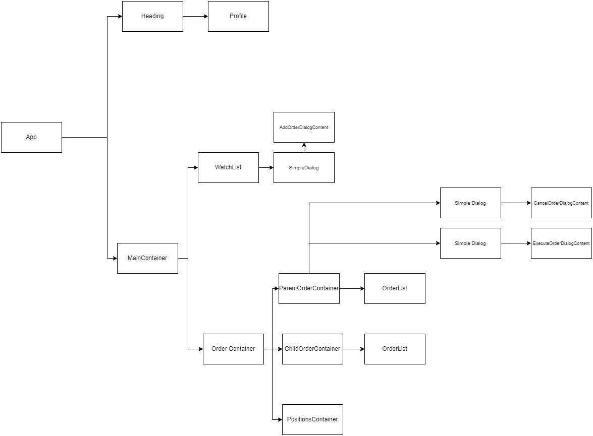
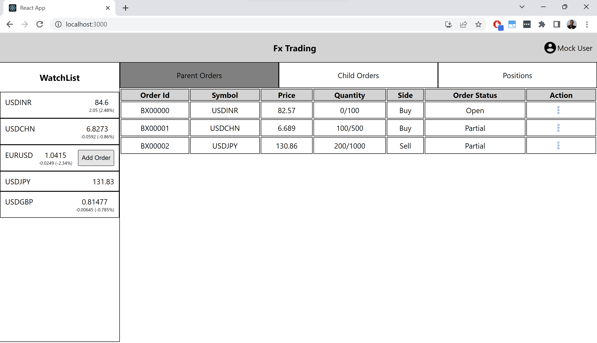
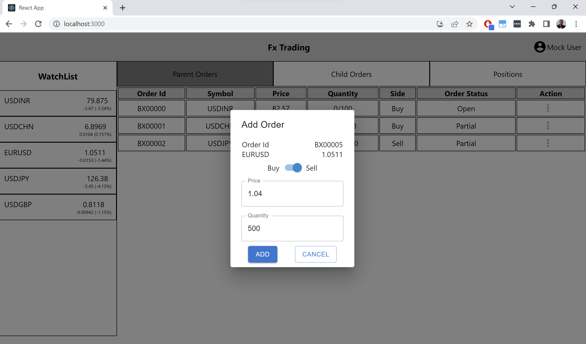
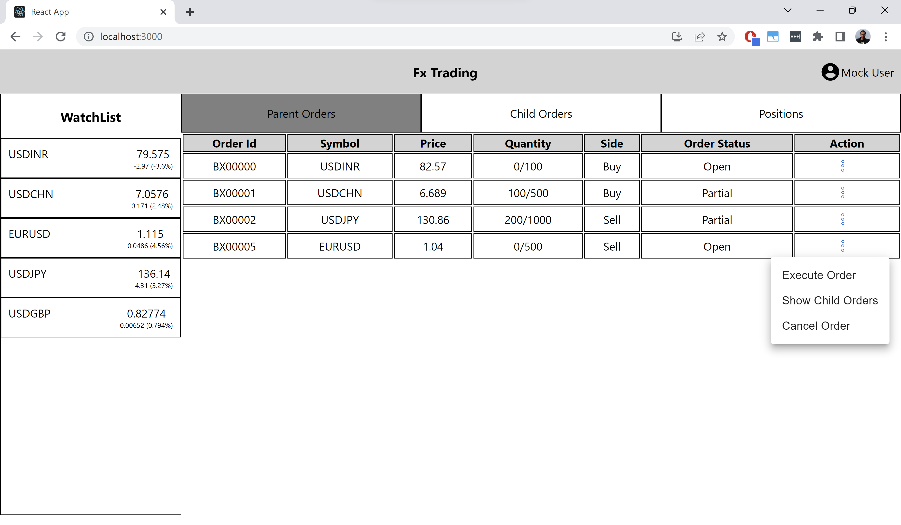
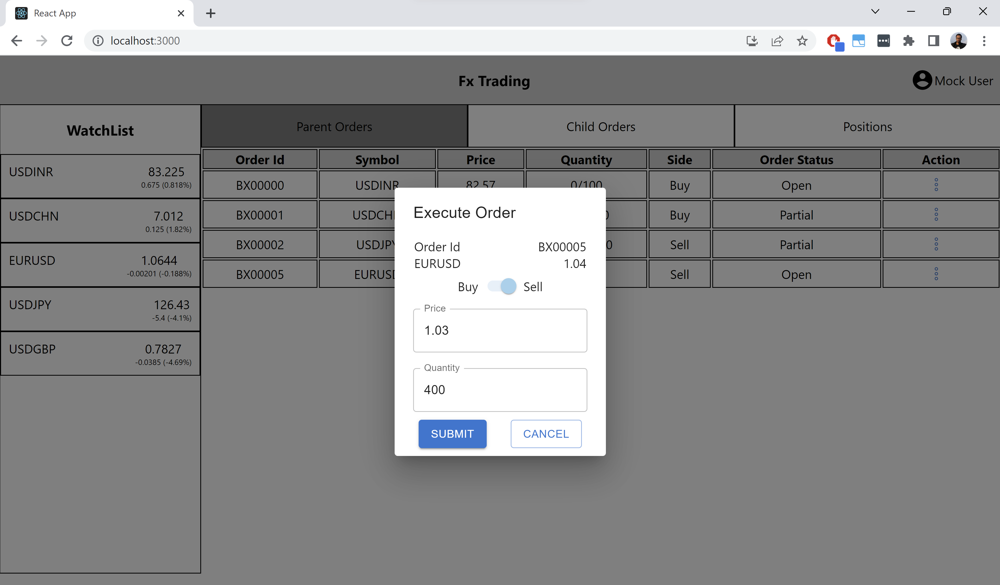
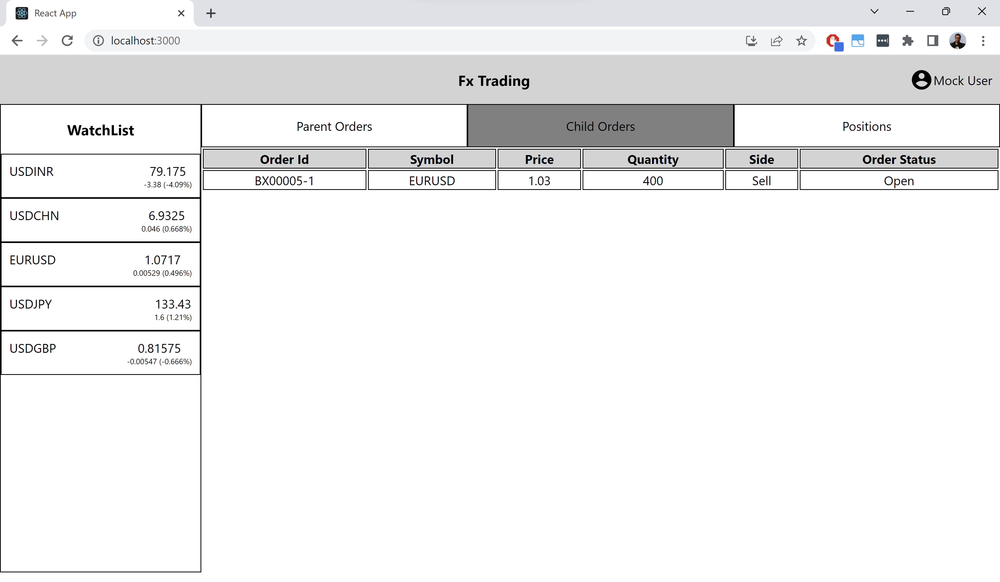
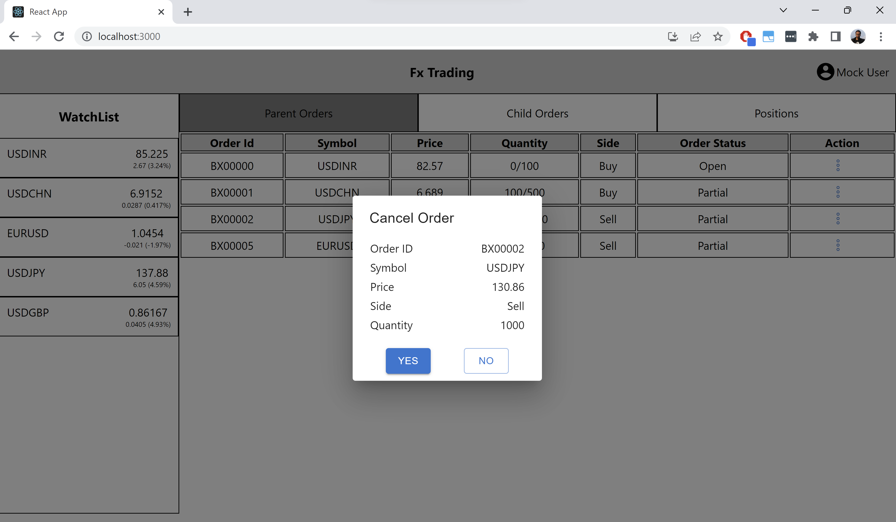
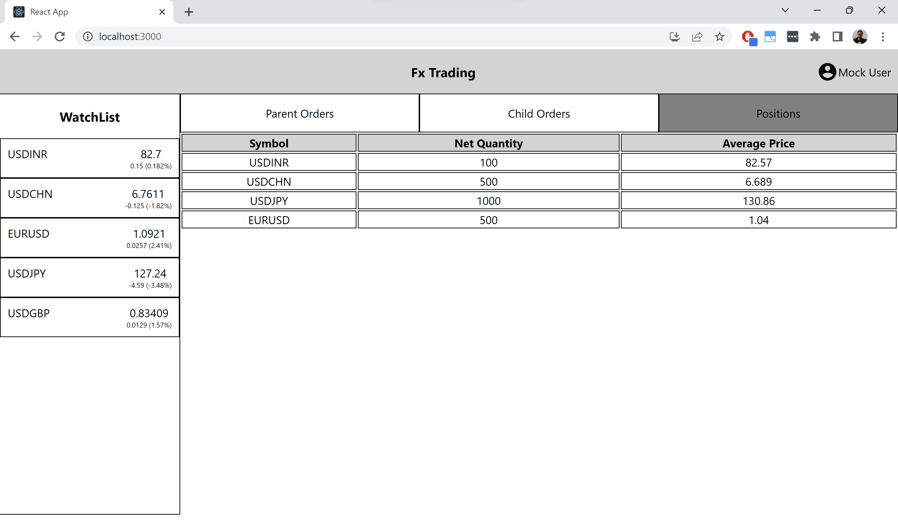

# Getting Started with BestEx App

This project was bootstrapped with [Create React App](https://github.com/facebook/create-react-app).

## Available Scripts

In the project directory, you can run:

### `npm start`

Runs the app in the development mode.\
Open [http://localhost:3000](http://localhost:3000) to view it in the browser.

## Versions
node - v16.19.0

npm - 8.19.3

# Code

## Folder Structure
    src 
        - apis 
        - components
            common
            mainconainer
            heading
        - utils 
        - mock
        - models
    App.tsx
    package.json

## APIs
We have watchlist and order apis inside the apis folder. Currently, we use the mock data as the response of the apis.

1. fetchLastDayCurrencyPairClosePrices
2. fetchOrders


## Component Hierarchy



## Main Components

| Component   | Details |
| ------------- | ------------- |
| App.tsx  | Entry Point of the app.  |
| WatchList.tsx  | WatchList component, It shows the currency price, which updates every second.  |
| OrderContainer.tsx  | Handles the navigation between the ParentOrders, ChildOrders &  Positions Tab|
| ParentOrderContainer.tsx  | Handles the Parent Orders & Actions  |
| ChildOrderContainer.tsx  | Shows the Child Order Data  |
| PositionsContainer.tsx  | Show the posiitons data  |

## Models

All the models are defined in the models folder in the source directory.

```
// User
User {
    id: string;
    name: string;
    email: string; 
}

// CurrencyPair, The data retrieved from the watchlist api.
CurrencyPair {
    id: string,
    name: string,
    value: string
}

// Currency Pair Data, Used internally in the WatchList component for managing the Currency Data
CurrencyPairData {
    id: string
    name: string
    closePrice: number
    updatePrice: number
    percentChange: number
    actualChange: number
    tickSize: number
    maxFactorX: number
}

// Order
Order {
    orderId: string, 
    symbol: string,
    price: number,
    quantity: number,
    side: Side,
    orderStatus: OrderStatus,
}
```
### Types

```
// Parent Order
ParentOrder = Order & {
    tradedQuantity?: number,
    spreadCost?: number,
    remainingQuantity: number,
    childOrders?: Array<Order>
}

// Child Order
ChildOrder = Order & {
    parentOrderId: string
}

```
## Mock Data
The mock api responses are defined in the mock folder in data.ts file. 

## Formulaes Used

#### Circuit Limit

limit = +/- 5%  

#### Tick Size

It is provided for each currency pair defined in constants.ts file in the utils folder.

#### Update Price
UpdatePrice = ClosePrice + (+/- x * tickSize)

#### x calculation
It is referred as maxXFactor in the code. The x should be generated such that the variation of the update price should be in the circuit limits.

```
limit = 0.05
maxDiff = ClosePrice * limit
maxXFactor =  Math.floor(maxDiff / tickSize)

ex.
closePrice = 82.5500, tickSize = 0.025, limit = +/-5%
maxDiff = (closePrice* upperLimit)/100 = 4.1275
maxXFactor = Math.floor(maxDiff / tickSize) = 165
```
So, using above formulae, x can varies between 0 to maxXFactor.

## Screenshots

First Look of the bestex app.


WatchList - Add Order on hover


Add Order Dialog


Shw Order Actions - Execute Orders, Show Child Orders & Cancel Order


Execute Order Dialog


Show Child Orders


Cancel Order Dialog


Positions Tab


